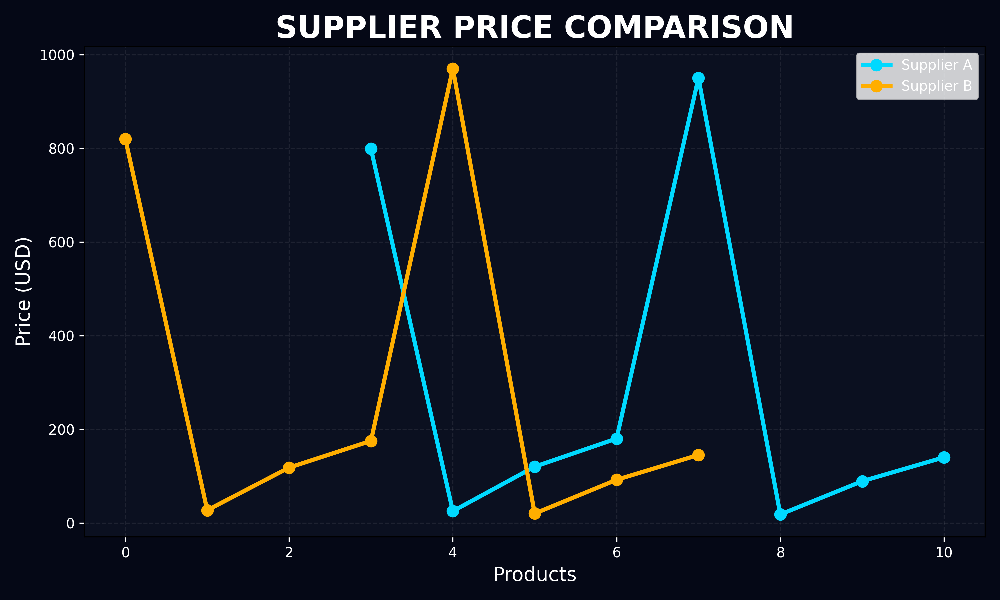

# ai-product-matching-analysis

This project compares product and pricing data from two different suppliers using Python, Pandas, and Matplotlib.

The program reads multiple Excel sheets, analyzes supplier prices, 
generates comparison charts, and automatically creates a detailed report file.

# Features

- Read Excel data from multiple sheets
- Compare Supplier A and Supplier B
- Analyze average product prices
- Find highest and lowest prices
- Generate automated comparison charts
- Create report.txt automatically
- Business-oriented supplier analysis workflow

# Technologies Used

- Python
- Pandas
- Matplotlib
- Excel (.xlsx)

# Preview

# Author

JG Automation & Data
